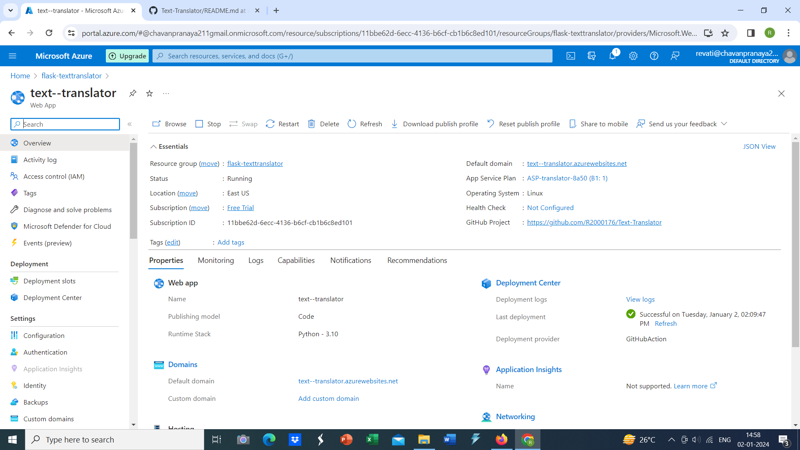
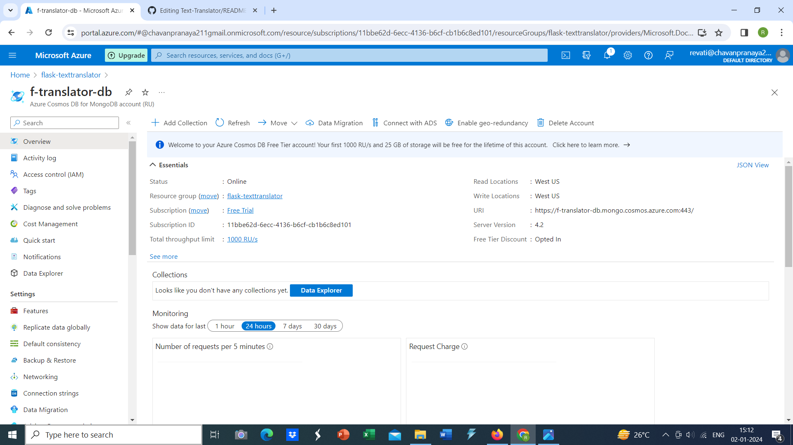
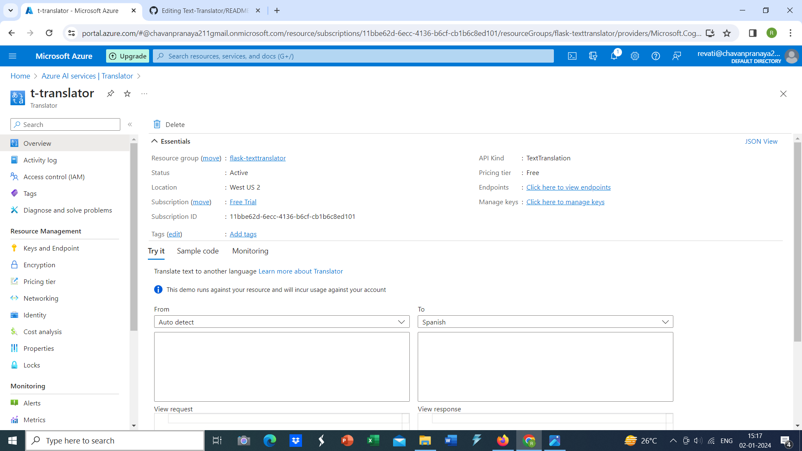
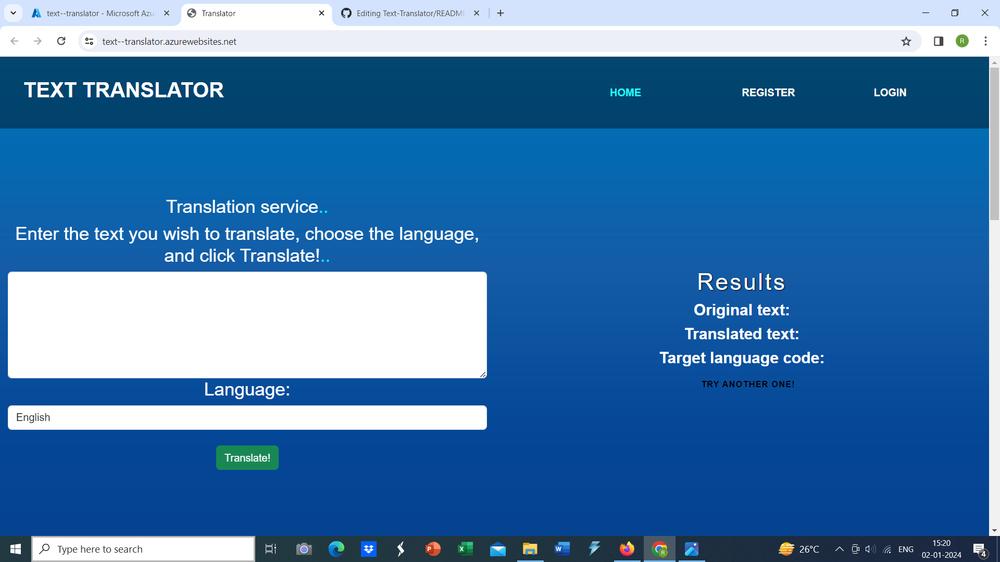
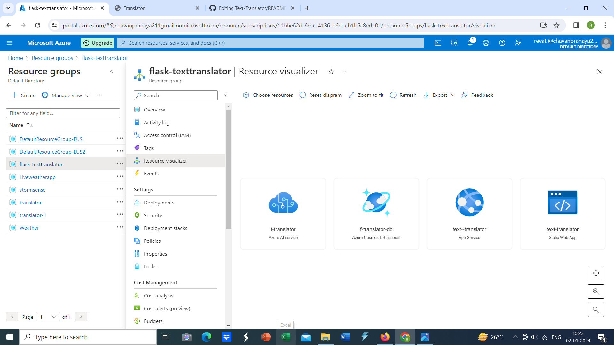

# Microsoft-Future-Ready-Talent-Virtual-Internship-Project

## Project Title: Text Translator
[Text Translator](https://text--translator.azurewebsites.net/)

## Project Details
**Project Demo URL:** [https://text--translator.azurewebsites.net/](https://text--translator.azurewebsites.net/)  
**Demo Video URL:** <!-- https://drive.google.com/file/d/1Nlrc_KM9Ed9POH-7pauok_m4hyyVe5Xc/view?usp=drive_link -->  
**Github Repository URL:** [https://github.com/R2000176/Text-Translator](https://github.com/R2000176/Text-Translator)  
**Industry:** Lifestyle and Technology

## Azure Services Used

### Core Azure Services:
1. **Azure App Service:** Deployed the Python backend environment for text manipulation.
2. **Azure Cosmos DB:** Leveraged as a MongoDB repository to store search history.
3. **Azure Static Web Apps:** Hosted the front end of the website for user interaction.

### Azure AI Service
1. **Azure AI Translator Service:** Utilized for text translation into multiple languages.

## Problem Statement
In today's connected world, handling text effectively has become crucial. People need tools that can work with text in different ways, such as changing its format, translating it, or summarizing it. Building software that can do all these things and still work well with a lot of text is challenging.

## Project Description
The Text Translator Website is an advanced platform providing various tools to make it easy for users to work with text in different ways. It's made using Python, hosted on Azure Static Web Apps, and utilizes Azure Cosmos DB for secure storage of user data. The website offers a smart tool for handling text, designed to be easy to use, reliable, and secure.

**Key Features:**
- Multilingual Translation: Utilizes Azure AI Translator Service to translate text into multiple languages.
- Text Summary: Provides word and character summaries of inputted text.

**Future Enhancements:**
The project plans to grow by using advanced Azure Cognitive Services, adding real-time collaboration features, and improving text processing with machine learning.

## Core Azure Services
- **Azure App Service:** Hosts the Python backend for text manipulation.
- **Azure Cosmos DB:** Stores and manages user search history.
- **Azure Static Web Apps:** Deploys and hosts the user-friendly frontend.

## Azure AI Service
- **Azure AI Translator Service:** Powers the translation functionality with advanced natural language processing.

## Other Azure Technologies / Services
- **Azure Functions:** Potential use for background processing tasks or additional functionalities.
- **Azure Key Vault:** Securely manages keys, secrets, and certificates.

## Screenshots

### Azure App Service

### Azure Cosmos DB

### Azure AI Translator Service

### Working Live Project Display

### Resource Visualizer

## Final Project Statement
The Text Translator Website is a comprehensive solution leveraging Azure services to offer users a versatile platform for efficient text manipulation, translation, and summarization. By harnessing the power of Azure App Service, Cosmos DB, Static Web Apps, and the Azure AI Translator Service, this project provides a seamless and scalable text management experience, catering to diverse user needs in a connected global landscape.
